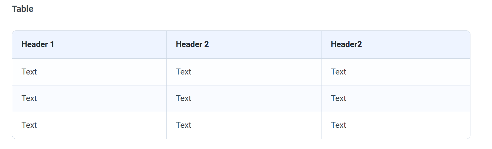

# Gitbook Theme For Typora
[English README](README.md)

这个 Typora 主题项目的设计灵感来自 [Gitbook](https://www.gitbook.com) 的文档风格，提供 *Azure*、*Slate* 和 *Teal* 三个变体。

> 主题已在 Windows 10 和 macOS 上设计与测试。尚未在 Linux 上验证，但理论上也应可以正常使用。

## 安装说明
1. 从 [这里](https://github.com/Henning16/typora-gitbook-theme/releases/latest) 下载最新发布的压缩包，并解压。
2. 将 `gitbook-azure.css`、`gitbook-slate.css`、`gitbook-teal.css` 这三个文件，以及名为 `gitbook` 的文件夹，一起复制到 Typora 的主题目录中。**这个文件夹必须一并复制，因为其中包含主题正常工作所需的重要文件和字体。**
3. 启动或重启 Typora，然后在主题菜单中选择 *Gitbook Azure*、*Gitbook Slate* 或 *Gitbook Teal*。

## 参与贡献
如果你发现主题存在显示问题、效果不符合预期，或者有改进建议，欢迎[提交 issue](https://github.com/Henning16/typora-gitbook-theme/issues/new)。如果你愿意，也可以基于这个主题制作自己的变体，或者直接提交 pull request。

> **请注意**：这个主题仍在持续开发中，后续还会继续更新。

## 自定义修改
如果你更喜欢 1.9 版本之前的 Slate 配色方案（整体会更亮一些，也更接近 slate 的感觉），可以打开 `gitbook-slate.css`，将第二行的 `@import "gitbook/slate-colors.css";` 改为 `@import "gitbook/old-slate-colors.css";`。修改后保存文件并重启 Typora，颜色才会正确更新。有时候还需要先切换到其他主题，再切回 Gitbook Slate 主题，修改才能生效。

你也可以像 [chchen-standford 在这里提到的那样](https://github.com/16soundsofsilence/typora-gitbook-theme/issues/14#issuecomment-784175419)，把这些自定义内容写到单独的 CSS 文件里。

## 细节展示

## 较早版本截图

下面这些截图不是最新状态，但仍然可以展示 Slate 和 Teal 两个变体，以及一些 Windows 平台下的界面效果。

